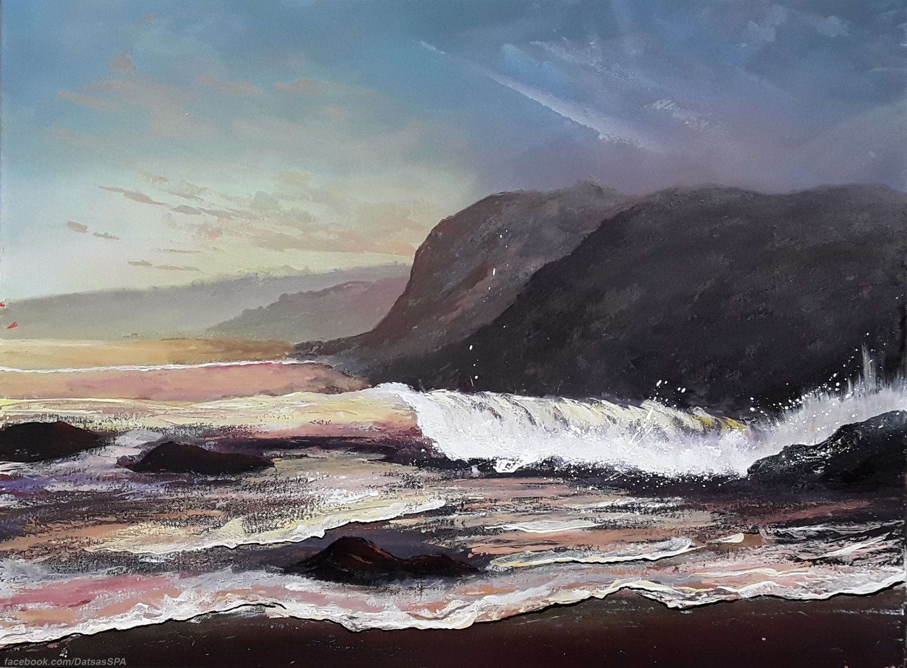



* Date of birth: 13-04-1991
* Country of origin: Greece
* Current address: Göttingen, Germany

# Education

* Ph.D. (ongoing) with title "Mesoscopic Transport Theory for Graphene Nanostructures", Max Planck Institute for Dynamics and Self-Organization & University of Göttingen, Germany
* M.Sc. in Physics of Materials, University of Athens, 2014-2016. *Grade: 9.28/10.0*
* B.Sc. in Physics, University of Athens, 2009-2014. *Grade: 8.06/10.0*

# Awards

* **DSWeb2018 Dynamical System Software international competition by SIAM**

    First place winner of category "Graduate/Undergraduate", using the software **DynamicalSystems.jl** as a submission. For more details please see the [official statement](https://dsweb.siam.org/The-Magazine/Article/winners-of-the-dsweb-2018-software-contest).

* **International Max Planck Research School Scholarship (2016 - 2019)**

    3-years scholarship that covers a full PhD project and was awarded to me on July/2016 for my project “Mesoscopic Transport Theory for Graphene Nanostructures".

# Publications

  <ul>
    
  </ul>

# Teaching

  <ul>
    
  </ul>

# Developed Software

* [**DynamicalSystems.jl**](https://juliadynamics.github.io/DynamicalBilliards.jl/latest/)

* [`DynamicalBilliards`](https://juliadynamics.github.io/DynamicalBilliards.jl/latest/)

* Most packages of [JuliaMusic](https://juliamusic.github.io/JuliaMusic_documentation.jl/latest/)

# Expertise in Arts

**Professional Drummer** - Graduated from Philippos Nakas school of music in association with Berklee college of music. The diploma in modern drumset and theory of jazz music was awarded to me in July 2015. During my life as a drummer I have played in more than 30 bands while leading about half of them.

**Spray Paint Artist** - I have hosted numerous painting exhibitions, including one at a municipal art-gallery. I have also run a free 12-week art workshop, where I voluntarily teach other people the art of spray painting (the workshop has been done 3 times so far).

# Computer Skills

* Expert: Python, Julia, LaTeX, Microsoft Office, Cubase.
* Intermediate: C, Photoshop, Corel Photo-paint.
* Basic: Mathematica, Computer Hardware and Support, 3D Modelling in Maya-2012.

# Talks

You can visit the [talks page of my webpage](https://datseris.github.io/talks/) for a full list of talks I have given over the years.

<!-- <ul>
  
</ul> -->

# Interests
- Science
- Music
- Painting
- Videogames
- Cooking
- Software Development
