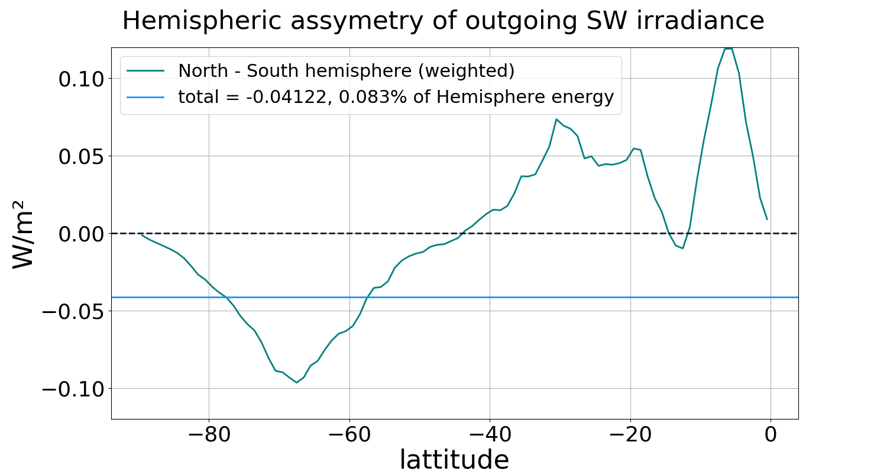

My research interests can be summarized as follows:

* Conceptual climate models
* Nonlinear timeseries analysis of climate-related observations
* Education of nonlinear dynamics
* Scientific reproducibility
* Music timeseries analysis and the dynamics of music
* Dynamical billiards and Hamiltonian chaos

The physics I was studying in my PhD was electron transport in nanodevices, both quantum and classical. For my postdoc I am turning the scales up a notch, currently studying planetary albedo. I am applying my main discipline (nonlinear dynamics) into meteorology, with a particular focus on timeseries analysis and conceptual models. In parallel to the core physics research, I am interested in music, both scientifically as well as artistically. I analyze music timeseries and try to find mathematical rules to describe both the process of playing music, as well the human perception of it.

*this page only lists currently active research projects, finished projects are published (see "Publications")*

Currently active projects:

1. [Planetary albedo](#planetary-albedo)
2. [Synchronization between musicians](#synchronization-between-musicians)
3. [Nonlinear dynamics education](#nonlinear-dynamics-education)
4. [Scientific reproducibility](#scientific-reproducibility)

## Planetary albedo
The planetary albedo α, an intrinsic property of a planet, measures the average amount of reflected solar radiation, as seen from space.
Its value directly influences the energy balance of the planet, and as a result its average temperature.
For the Earth, recent satellite observations provided by [CERES](https://ceres.larc.nasa.gov/) made it possible to accurately measure α, and at long term temporal average we obtain α≈0.29.

There are many basic things we don't understand about the Earth's planetary albedo. For example, why is its value 0.29? Why not 0.39? What processes decide this value? How are they affected by human-driven changes (global warming) but also external (changes in the Earth's orbit)?

Another surprising fact is the so called *hemispheric albedo symmetry*. When averaged over each hemisphere of the Earth, one obtains the same albedo value α≈0.29.
Although it is clear that this happens because clouds exist, there is no reason to a-priory expect that clouds would balance the existing surface asymmetries of the planet.

In my project I have two goals:
1. Provide a rigorous analysis of what knowledge can be obtained from observational timeseries of the Earth's energy balance.
2. Provide a conceptual (theoretical) framework to understand the dynamics of planetary energy balance.

Goal 1 is well underway, and its outcome will be used as guiding principles for goal 2. One of the ways I approach goal 1 is via *statistical and nonlinear timeseries analysis*. For example, from the CERES campaign I obtain hemispherically-averaged timeseries of the reflected solar radiation (at the top of the atmosphere, i.e. as seen from space). I decompose such timeseries to their fundamental constituents. Here is an exemplary figure:

Here the outgoing radiation is decomposed into a *seasonal* component (i.e. purely periodic oscillations) and a *residual* component, which represents internal non-periodic fluctuations. My analysis then provides rigorous statements about what we can, and cannot know, regarding the dynamics of the Earth, from these timeseries.

While my work is currently focusing on observational data specifically about the Earth, it is my hope that by the end of my postdoc we will have statements about the dynamics of the energy balance of planets in a more general sense.

## Synchronization between musicians
Music is perhaps the biggest cultural achievement of humanity. But music is also a very complex process. This is because of the huge number of factors involved. Besides the actual music notes themselves, a process at least three dimensional (time, intensity, pitch), there is also human interaction, expression, and improvisation. Yet, what has become clear in recent years, is that the timeseries of human music performances are underlined by seemingly universal mathematical patterns. For example, the timeseries of timing, intensity, and even pitch fluctuations seem to be accurately represented by pink noise processes: they are random, but also with power-law-like temporal correlations. I describe all of these findings in an invited talk I gave at the University of Nottingham, which is [available on YouTube](https://www.youtube.com/watch?v=9wzr5DFHJ48).

What I am currently interested in is how musicians synchronize. For example, the following plot comes from a recording of "Heard it through the grapevine" that I have played with the keyboard player of my band (see the "Music" page if you are interested). The x-axis is simply time, while the y-axis shows the temporal deviations of the played notes of either drums (blue) or piano (orange).

While its clear that these timeseries are "random" (this pink noise we mentioned above), it is also clearly that they are very much dependent on each other. The fluctuations go up and down together, and this happens because the two musicians are "synchronized" with each other. I am currently analyzing the nature of this synchronization, and how it can exist in such a setting, where the timing of the musicians have a stochastic nature. I am also interested in understanding how a metronome affects this synchronization. Musicians generally agree that it is easier to synchronize with each other in the *absence* of a metronome. From a scientific perspective, the opposite should be true: since the timings of humans are stochastic, having a purely deterministic perfectly periodic signal should make synchronization easier. That's not the case, but why and how? To answer these questions I perform experiments, recording musicians and then analyzing the recorded timeseries.

## Nonlinear dynamics education
Chaos theory is arguably one of the most beautiful frameworks to approach the world. However, nonlinear dynamics, the root of chaos theory, are rarely tractable analytically. Thus, a "nonlinear dynamicist" always works hand-in-hand with a computer and numerical simulations.

There are dozens of textbooks on nonlinear dynamics. Oddly enough, none of them represents code sufficiently, while most don't even talk about it. I believe this should be changed, and education of nonlinear dynamics should have both equations and code next to each other. Technology has thankfully advanced enough to allow one to solve complicated problems while writing concise, expressive, high level code. I am aiming to take advantage of this progress into a new introductory textbook about nonlinear dynamics I am co-authoring with Prof. [Ulrich Parlitz](https://www.uni-goettingen.de/en/105320.html). To give you an idea, here are two excerpts. In the fist one is a real, runnable implementation of an algorithm to compute the Lyapunov exponents. It is shown in text as a special "Code" environment, like a "Figure" or "Table" environment:

In the second excerpt we show a figure of how the entropy of a chaotic set changes with the partition size. Next to the figure is the *full code necessary to reproduce it*.

All of this is possible for two reasons: first, the code snippets use a high-level expressive new language designed for scientific computing called [Julia](https://julialang.org/). The second reason is the existence of an award-winning software library for nonlinear dynamics and chaos, called [DynamicalSystems.jl](https://juliadynamics.github.io/DynamicalSystems.jl/dev/) that I wrote while developing scientific software (see the "Software" page for more).

Having such a book comes with clear advantages: the students don't have to spend hours, or even days, writing a code implementation of an algorithm they read about, and they can instead experiment with it immediately. In addition this way there is education about code, which for a nonlinear dynamicist is certainly "half part of the job".

## Scientific reproducibility

Science is hard, and reproducing it is just as hard. There are many difficulties, but what I am interested in resolving is the difficulty of reproducing scientific code. After years of work, we have managed to create a simple software that makes reproducing a scientific project a piece of cake. For more details on that front, I invite you to have a look at our short paper on this software, called [DrWatson](https://joss.theoj.org/papers/10.21105/joss.02673).

Besides good software however, the scientific community needs an even bigger change to truly resolve the difficulty of reproducing scientific work. And that is, to embrace code as an integral part of science, just as integral as mathematical equations. In short, I believe that if you feel the need to publish in your paper the mathematical equations you used and derived in your work, then you should feel just as strong of a need to publish the code you used.
What makes this not so straightforward is that just putting code somewhere is not good enough. We must also ensure that the code is actually reproducible. To do this, I think we need to properly educate students on how to write good code, how to make it reproducible, and how to share it.

I'm currently working on producing such lectures. An initial work on this topic can be found in the following [YouTube video](https://www.youtube.com/watch?v=iIIBFujl254).