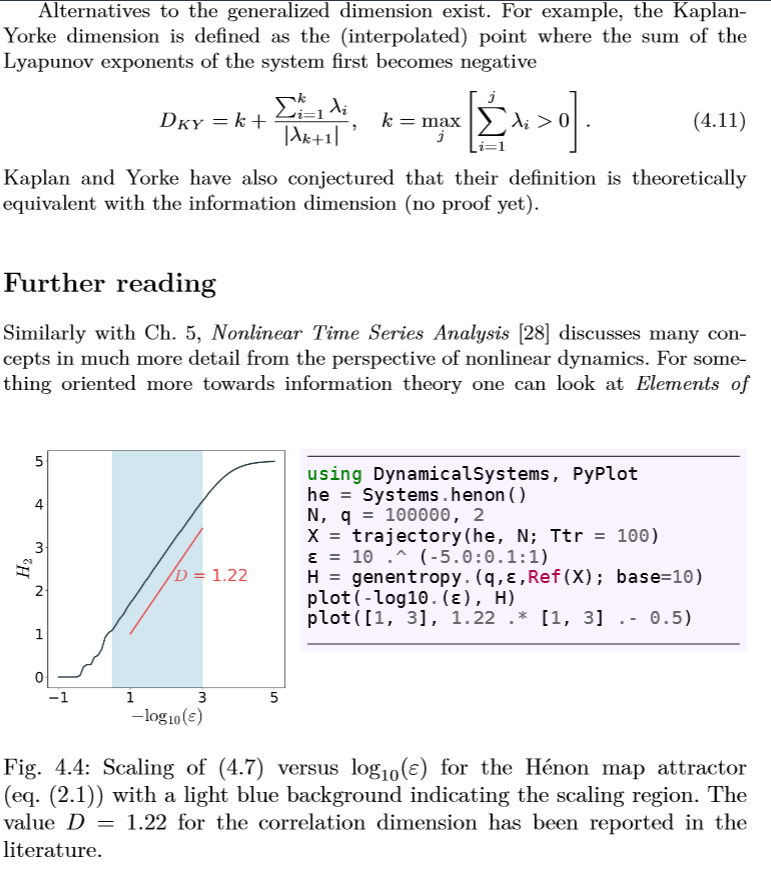
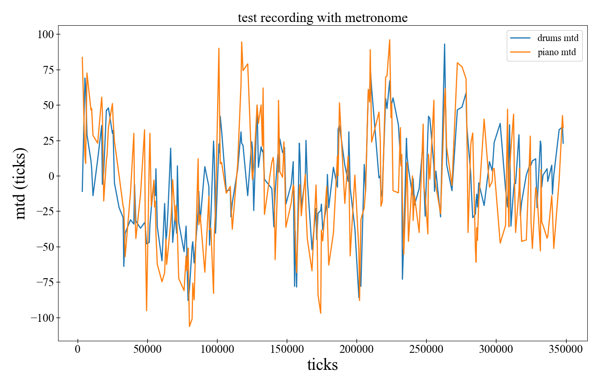

What fascinates me about our world is how **incredibly complex behavior can arise from incredibly simple rules**. This is why I've chosen **nonlinear dynamics** as my main area of scientific quest. Nonlinear dynamical systems could very well be the definition of "complex behavior from simple rules". Similarly, I am fascinated by **emergent phenomena**, where fundamentally new behaviors arise in a system, behaviors not at all obvious from the behaviors of its individual constituents. Emergence, and its importance in scientific thinking, has been summarized very well the sentence **More is Different**, popularized by Anderson in the 80s [1]. It certainly is a sentence that I structure my scientific thinking around.

I am active in a broad spectrum of complex systems: from approaching climate conceptually as a whole and understanding its emergent large-scale interactions, to nonlinear timeseries of climate observations and inferring causal linkages from them, to emerging simple behaviors in socioeconomic systems and their agent based modelling, to the dynamics of music performances, and lastly to fundamental nonlinear dynamics theory and methodology. Furthermore, because all of these systems are so fascinating, I also want to share with the world the power to play with them and understand them just as well I do (and hopefully even better). To this end, I am constantly making high-quality scientific software that make analyzing complex systems accessible, and also I am highly involved in education that teaches how to approach complex systems using a practical, hands-on style.

### Summary of Current Research

1. [Conceptual models for climate](#conceptual-models-for-climate)
2. [Timeseries analysis of climatic observations](#timeseries-analysis-of-climatic-observations)
3. [Complex systems methodology and software](#complex-systems-methodology-and-software)
4. [Practical approach to education](#practical-approach-to-education)
5. [Dynamics of music performances](#dynamics-of-music-performances)

## Conceptual models for climate
Weather is the paradigmatic example of chaotic systems. Atmospheric turbulence is a process so complicated, that scientists that develop forecasting models prefer to represent turbulence as a noise process instead [2]. But even though our planet is so large, with an almost overwhelming amount of chaotic turbulence, climate is in a sense much simpler. Larger and simpler patterns emerge, such as the robust seasonal cycle of most climatic variables. and the more we look into the past, the more of such patterns we see. For example, it is by now well established that Earth's climate has gone through several "cycles" between a glacial state, and a state similar to today's climate [3]. 

I am currently trying to derive such a simple emergent picture for planetary cloudiness, one of the most complex, but also most beautiful components of the climate system. I will be posting more details as more progress comes on this front.

## Timeseries analysis of climatic observations
I am interested in applying timeseries analysis techniques to discover connections, and maybe even rules, governing components of the climate system. I am routinely using a combination of methodologies from rigorous statistics and nonlinear timeseries analysis on observational and/or paleoclimate datasets. For example, in a recent paper with Bjorn Stevens, we were able to apply the technique of surrogate timeseries in the curious case of Earth's hemispheric albedo symmetry [4]. We showed that if some emergent, large-scale mechanism exists that establishes this symmetry, its timescale should be decadal to centurial.

At the moment, I am using similar approaches to understand how temperature differences between warm and cold ocean regions behave as the climate system evolves over millennial timescales.

## Complex systems methodology and software
I make no distinction between scientific methodology and software development. None whatsoever. Just as a methodological advancement may enable understanding a system from a new perspective, just as well a high-quality software may make an analysis more natural, more effortless, hence leading to similar level of breakthroughs. Developing both methodologies and software needs creativity, ingenuity and really hard work. Unfortunately, spending time on software is not rewarded by typical "measures of scientific success", but I am actively advocating for a change on this front.

With a lot of talented people we constitute [JuliaDynamics](https://github.com/JuliaDynamics), of which I am the lead developer. There we are developing new software that allow analyzing complex systems with much less effort that ever before. The same software, due their intuitive structure and extendability, also allow us to create new algorithms that surpass existing ones in both usability, but also performance. The most important aspect of our efforts however, is their openness. We take extra care so that the open source code we write is transparent and accessible. 

In my own experience this openness has led to much more collaborations I could think of. For example, our work on Agents.jl, a framework for agent based modelling used for e.g. socioeconomic systems, showed that we have designed something better and simpler than ever before [5]. Other software, such as DynamicalSystems.jl, allowed us to develop a generic algorithm for finding attractors for arbitrary dynamical systems [6]. Such generality would be really difficult to achieve if we were to start from zero, without having a generic library to begin with. I strongly believe that [JuliaDynamics](https://github.com/JuliaDynamics) is a living example of how scientific algorithms and software quality should not be thought of as independent things.

## Practical approach to education
This section is actually directly tied with the previous one. There are dozens of textbooks on nonlinear dynamics. Oddly enough, none of them represents code sufficiently, while most don't even talk about it. This is in line with the weird scientific perception that "code is not science" because of even more weird reward system of scientific success.

I believe this should be changed, cut directly from the root. Hence, the best way to change this is by changing how we educate new generations to perceive code and practical aspects. Technology has thankfully advanced enough to allow one to solve complicated problems while writing concise, expressive, high level code. With Ulrich Parlitz we have taken advantage of this progress, and engraved a new perspective into nonlinear dynamics into a new introductory textbook. The textbook is called "Nonlinear Dynamics: an introduction interlaced with code" and is [published by Springer-Nature](https://link.springer.com/book/9783030910334). in the "Undergraduate Lecture Notes in Physics" series. It has a fresh approach that explicitly discusses practical aspects and writing code. You can find more details about the book in this [short video presentation](https://www.youtube.com/watch?v=04HAQXl5aj4).

To give you an idea, here is an excerpt. We show a figure of how the entropy of a chaotic set changes with the partition size. Next to the figure is the *full code necessary to reproduce it*.

I'm also using this new approach to make accessible public-oriented educational videos.

* [Explanation of the butterfly effect and deterministic chaos using billiards](https://www.youtube.com/watch?v=svV1MsUdInE)

## Dynamics of music performances
Music is perhaps the biggest cultural achievement of humanity. But music is also a very complex process. This is because of the huge number of factors involved. Besides the actual music notes themselves, a process at least three dimensional (time, intensity, pitch), there is also human interaction, expression, and improvisation. Yet, what has become clear in recent years, is that the timeseries of human music performances are underlined by seemingly universal mathematical patterns. For example, the timeseries of timing, intensity, and even pitch fluctuations seem to be accurately represented by pink noise processes: they are random, but also with power-law-like temporal correlations. I describe all of these findings in an invited talk I gave at the University of Nottingham, which is [available on YouTube](https://www.youtube.com/watch?v=9wzr5DFHJ48).

What I am currently interested in is how musicians synchronize. For example, the following plot comes from a recording of "Heard it through the grapevine" that I have played with the keyboard player of my band (see the "Music" page if you are interested). The x-axis is simply time, while the y-axis shows the temporal deviations of the played notes of either drums (blue) or piano (orange).

While these timeseries are in a sense "random" (this pink noise we mentioned above), it is also clear that they are very much correlated on each other. The fluctuations go up and down together, and this happens because the two musicians are "synchronized" with each other. I am currently analyzing the nature of this synchronization, and how it can exist in such a setting, where the timing of the musicians have a stochastic nature. I am also interested in understanding how a metronome affects this synchronization. Musicians generally agree that it is easier to synchronize with each other in the *absence* of a metronome. From a scientific perspective, the opposite should be true: since the timings of humans are stochastic, having a purely deterministic perfectly periodic signal should make synchronization easier. That's not the case, but why and how? To answer these questions I perform experiments, recording musicians and then analyzing the recorded timeseries.

**References**

1. [Anderson (1972), Science 177, 4047](https://www.science.org/doi/10.1126/science.177.4047.393)
2. [Franzke et al. (2014), WIREs Clim. Change 6, 63](https://wires.onlinelibrary.wiley.com/doi/10.1002/wcc.318)
3. [Crucifix (2012), Phil. Trans. R. Soc. A 370, 1140](https://royalsocietypublishing.org/doi/10.1098/rsta.2011.0315)
4. [Datseris and Stevens (2021), AGU Advances, 2, e2021AV000440](https://agupubs.onlinelibrary.wiley.com/doi/10.1029/2021AV000440)
5. [Datseris et al. (2022), SIMULATION](https://journals.sagepub.com/doi/10.1177/00375497211068820)
6. [Datseris and Wagemakers (20220), Chaos 32, 023104](https://doi.org/10.1063/5.0076568)