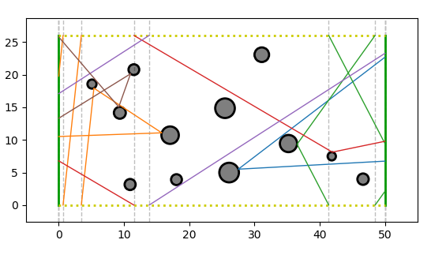

I don't write a blog, but this is something I wanted to put online, and this webpage is pretty much the only place I have. So, in this "blog post", I will describe the process I went through to design the tattoo I have on my left sleeve:


## Introduction

The tattoo is inspired by a real physical system. The lines represent electrons inside a nanodevice, which are scattered from the dots, representing scattering centers in the device.
This is a topic that I have been working a lot during my PhD [1, 2, 3], and the way I approached this electron system was through dynamical billiards:

> A dynamical billiard is a system where a particle is propagating inside a domain, bouncing from obstacle to obstacle by a specular reflection at the boundary of the obstacles.

For example, here is a simple billiard, called the *periodic Sinai billiard*:


I have always found these plots artistically very pleasant. In addition, dynamical billiards are a truly fascinating class of systems. Not only they can model so many different aspects of reality (from electrons in a nanodevice, to lasers and even waves), but they are also conceptually simple. Even though everyone can understand billiards (I believe), they can still illustrate all aspects of chaos (meaning deterministic chaos of nonlinear dynamics). That is why after doing research on billiards, I have started using them as teaching tools in my lectures on nonlinear dynamics.

So, I decided to get a version of them as a tattoo. That was my graduation gift to myself and also the fulfillment of my childhood-long dream of having a sleeve tattoo.
I'll leave the science behind these electrons in a nanodevice to Refs. [1, 2, 3], and here discuss the process that lead to the tattoo.

## How to simulate billiards

So, plots like the one you see above are actually done with the following software I've developed during my PhD:


This bad boy is my pride and joy, and probably the hardest thing I have programmed in my life. Anyway, it is written in the Julia language, and with it, creating a plot like the one above is straightforward:
```julia
using DynamicalBilliards, PyPlot
# set colors of disks to black
DynamicalBilliards.obcolor(::Disk) = (0,0,0)
DynamicalBilliards.obalpha(::Disk) = 0.5
# simulate a particle in periodic Sinai billiard
bd = billiard_sinai(; setting = "periodic")
p = Particle(0.1, 0.5, 0.65)
xt, yt, vxt, vyt, t = timeseries!(p, bd, 10)
plot(bd, xt, yt)
plot(p);
```


In fact, you can play with such billiards in an interactive application!
For example:

```julia
using DynamicalBilliards, InteractiveChaos, Makie
bd = billiard_sinai(0.25f0, 1f0, 1f0)
interactive_billiard(bd);
```


## Arm to billiard
Alright, so my main goal now is to make a billiard that represents my arm. So the first step is to get some measurements down:
```julia
wrist_length = 18.0 # cm
elbow_length = 28.0
bicep_length = 34.0
wrist_to_elbow = 25.0
elbow_to_shoulder = 25.0
arm_length = wrist_to_elbow + elbow_to_shoulder # cm
const x, y, dt = arm_length, (wrist_length + bicep_length)/2, arm_length/100
```
Now as a proper physicist, I will make the simplifying assumption that an arm is a cylinder. Thus, I will create a billiard that is periodic in only one direction.

```julia
leftw = InfiniteWall([0, y], [0, 0])
rightw = InfiniteWall([x, 0], [x, y])
botw = PeriodicWall([0, 0.0], [x, 0], [0, y])
topw = PeriodicWall([0, y], [x, y], [0, -y])

walls = Billiard(leftw, rightw, botw, topw)
ax = plot(walls)
```


and then define a simple way to plot particles in this cylinder billiard
```julia
function interrupts(yt)
    ym = mod.(yt, y)
    is = [1]
    for i in 2:length(yt)
        abs(ym[i] - ym[i-1]) > dt && push!(is, i)
    end
    push!(is, length(yt))
    return ym, is
end

function plot_interrupted!(ax, xt, yt; kwargs...)
    ym, is = interrupts(yt)
    c = "C$(rand(0:9))"
    for j in 2:length(is)
        prev = is[j-1]; cur = is[j]
        lin = ax.axvline(xt[cur], color = "0.75", lw = 1.0, ls = "dashed", zorder = -99)
        tr, = ax.plot(xt[prev:cur-1], ym[prev:cur-1]; lw = 1.0, c=c, kwargs...)
    end
end

p = Particle(1, 1, π/5)
ax = plot(walls)
xt, yt = timeseries!(p, walls, 12.0; dt = dt)
plot_interrupted!(ax, xt, yt)
```


## Artistic choices
Alright, cylinders are good, but it is time to fill it with some scatterers.
And to be fair, the periodic Sinai billiard is a bit too bland, too "regular".
So what I thought I would do is randomly sprinkle some scatterers inside that each has a slightly different radius.
And you don't want to make the billiard too crowded, so there should also be some minimal distance between the scatterers.

So, using some random number generators and the API of DynamicalBilliards.jl one can get pretty far:

```julia
using Distributions, LinearAlgebra, Random
SEED, N, n, r0, σ = (26538, 6, 12, 1.0, 0.5)
Random.seed!(SEED)
buffer = arm_length/12 # minimum distance between disks
R = Normal(r0, σ)
rmin, rmax = 0.6, 1.5 # in cm

function randomdisk() # create a random disk
    r = clamp(rand(R), rmin, rmax)
    xd = rand(Uniform(r, x-r))
    yd = rand(Uniform(r, y-r))
    return Disk(SVector(xd, yd), r)
end
function intersection(a, b) # check the distance between two disks
    x = norm(a.c - b.c)
    x < (a.r + b.r) + buffer
end

disks = Disk[]
while length(disks) < n
    d = randomdisk()
    e = 1
    while any(i -> intersection(i, d), disks)
        d = randomdisk()
        e += 1
        e > 1000 && error("conditions not possible to be met.")
    end
    push!(disks, d)
end

bd = Billiard(walls.obstacles..., disks...)
plot(bd)
```


Nooooow we are cooking. Time to get some electrons going in there!

## Electrons in the arm
My main concern when trying to think of the trajectories, is that I only wanted trajectories that
1. Start and stop at the edges (left/right)
2. Collide with at least one of the disks

I was honestly surprised how easy it was to code this (damn, I love this DynamicalBilliards.jl so much):

```julia
function random_particle(j, ax = gca())
    p = randominside(bd)
    i = 0
    # bounce until left or right wall (i.e. reach the ends)
    while !(i == 1 || i == 2); i, = bounce!(p, bd); end
    # then evolve until condition `f` is met (i.e. reach the ends)
    f(n, t, i, p) = (i == 1 || i == 2)
    xt, yt = timeseries(p, bd, f, dt = 0.01)
    ym, is = interrupts(yt)
    plot_interrupted!(ax, xt, yt; color = "C$(j-1)")
end

ax = plot(bd)
for i in 1:N; random_particle(i, ax); end
```



And honestly, that's it.
I then produced about a 100 images like the one above to be sure I am well accustomed to the scatterer distribution and electron trajectories and also get some good ideas for the final design.

## The final design
When it comes down to this, the simplifying assumption "my arm is a cylinder" cannot be held anymore.
BUT, approximating it as a [conical frustum](https://en.wikipedia.org/wiki/Frustum) is good enough!
So, to make this long story short and wrap it up, I've made a (map-project) conical frustum of my arm using the measurements from above and created a billiard based on the simulated plots.

The result:


This was directly translated into my arm, here is the real tattoo again with some guiding colors


There is one small detail left: what are these waivy patterns that are on the arm but not on the sketch...? Well they are the "electron wavefunctions" of course! (quantum woo)

---

## References

[1]: https://iopscience.iop.org/article/10.1088/1367-2630/ab19cc/meta

[2]: https://aip.scitation.org/doi/full/10.1063/1.5099446

[3]: https://www.google.com/url?sa=t&rct=j&q=&esrc=s&source=web&cd=&ved=2ahUKEwi284b_gNnqAhVR3qQKHbiJBucQFjABegQIBBAB&url=https%3A%2F%2Fediss.uni-goettingen.de%2Fbitstream%2Fhandle%2F21.11130%2F00-1735-0000-0005-1278-0%2Fthesis_datseris.pdf%3Fsequence%3D1&usg=AOvVaw07G-SBOTd5MzR7IGH02eYa
